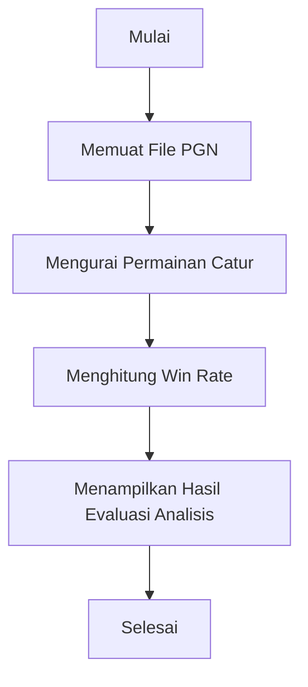

# 1. Chess Analyzer

Chess Analyzer adalah aplikasi GUI yang memungkinkan pengguna untuk menganalisis permainan catur dan mengidentifikasi kelemahan pada fase pembukaan. Aplikasi ini dibangun menggunakan Tkinter untuk GUI dan menggunakan pustaka `chess.pgn` untuk memparsing file PGN (Portable Game Notation).

## Fitur Utama

- **Memuat File PGN**: Pengguna dapat memuat file PGN untuk permainan catur putih dan hitam.
- **Analisis Pembukaan**: Menghitung win rate untuk setiap pembukaan berdasarkan warna.
- **Evaluasi Pembukaan**: Menampilkan pembukaan yang perlu dipelajari berdasarkan win rate terendah.
- **Tampilan GUI**: Antarmuka pengguna grafis yang intuitif dan mudah digunakan.
Berikut adalah contoh penulisan dalam format Markdown untuk menjelaskan poin-poin yang Anda sebutkan:

## 2. Ringkasan dan Permasalahan Project

### Ringkasan
Chess Analyzer adalah aplikasi yang dirancang untuk membantu pemain catur menganalisis permainan mereka dan mengidentifikasi kelemahan pada fase pembukaan. Aplikasi ini menggunakan file PGN (Portable Game Notation) untuk menganalisis permainan catur dan menghitung win rate untuk setiap pembukaan berdasarkan warna.

### Permasalahan
Permasalahan utama yang ingin diselesaikan oleh proyek ini adalah:
- Biaya yang cukup mahal untuk aplikasi analisis berbayar sekitar 600k/tahun.

### Tujuan yang Akan Dicapai
Tujuan dari proyek ini adalah:
- Menghemat biaya.

### Model / Alur Penyelesaian
Berikut adalah bagan alur penyelesaian proyek:



## 3. Penjelasan Dataset, EDA dan Proses Features Dataset

### Penjelasan Dataset
Dataset yang digunakan dalam proyek ini adalah file PGN yang berisi catatan permainan catur. File PGN dapat diunduh dari berbagai sumber seperti lichess.com atau chess.com. Dataset ini berisi informasi tentang gerakan catur dan hasil permainan.

### Exploratory Data Analysis (EDA)
EDA dilakukan untuk memahami struktur dan karakteristik dataset. Langkah-langkah EDA meliputi:
- Memuat file PGN dan mengurai permainan catur.
- Menghitung jumlah permainan untuk setiap pembukaan.
- Menghitung win rate untuk setiap pembukaan berdasarkan warna.

### Proses Features Dataset
Proses features dataset meliputi:
- Mengurai permainan catur menjadi daftar gerakan dan hasil.
- Mengelompokkan permainan berdasarkan pembukaan.
- Menghitung jumlah permainan dan win rate untuk setiap pembukaan.

## 4. Proses Learning / Modeling

Proses learning atau modeling dalam proyek ini meliputi:
- Memuat file PGN dan mengurai permainan catur.
- Menghitung win rate untuk setiap pembukaan berdasarkan warna.
- Menampilkan hasil analisis dalam bentuk tabel.
- Memberikan rekomendasi pembukaan yang perlu dipelajari lebih lanjut berdasarkan win rate terendah.

## 5. Performa Model

Performa model diukur berdasarkan kemampuan aplikasi untuk:
- Memuat dan mengurai file PGN dengan benar.
- Menghitung win rate untuk setiap pembukaan dengan akurat.
- Menampilkan hasil analisis dalam bentuk yang mudah dipahami oleh pengguna.
- Memberikan rekomendasi pembukaan yang relevan berdasarkan win rate.

## 6. Diskusi Hasil dan Kesimpulan

### Diskusi Hasil
Hasil analisis menunjukkan bahwa aplikasi Chess Analyzer dapat membantu pemain catur mengidentifikasi kelemahan pada fase pembukaan. Aplikasi ini berhasil menghitung win rate untuk setiap pembukaan dan memberikan rekomendasi pembukaan yang perlu dipelajari lebih lanjut.

### Kesimpulan
Proyek Chess Analyzer berhasil mencapai tujuan yang ditetapkan. Aplikasi ini dapat memuat file PGN, menganalisis permainan catur, menghitung win rate untuk setiap pembukaan, dan memberikan rekomendasi pembukaan yang perlu dipelajari lebih lanjut. Aplikasi ini dapat digunakan oleh pemain catur untuk meningkatkan permainan mereka dengan fokus pada pembukaan yang memiliki win rate terendah.

## Library yang Digunakan

- `tkinter`: Untuk membuat antarmuka pengguna grafis (GUI).
- `tkinter.filedialog`: Untuk operasi dialog file.
- `tkinter.messagebox`: Untuk menampilkan kotak pesan.
- `tkinter.ttk`: Untuk widget bertema.
- `chess.pgn`: Untuk memparsing file PGN (Portable Game Notation).
- `pandas`: Untuk manipulasi dan analisis data.
- `webbrowser`: Untuk membuka URL di peramban web.

## Proses Kerja


## Pengambilan Dataset
1. Anda bisa mendapatkan file PGN pribadi atau orang lain dari situs seperti lichess.com atau chess.com.
2. Pergi ke situs openingtree.com dan masukkan nickname Anda untuk menganalisis permainan Anda.
3. Setelah analisis selesai, unduh file PGN dari situs tersebut).

GUI memberikan akses dataset yang dapat diambil dari Google Drive dengan mengklik tombol "Dataset(Google Drive)" di GUI. Ini akan membuka URL Google Drive di peramban web.

```python
def show_datasets(self):
    webbrowser.open("https://drive.google.com/drive/folders/1_FWcpYO7noxe5gpb_DLPTKnc2PVimuzu?usp=sharing")
```

## Pra-pemrosesan Dataset
1. Ambil langkah-langkah permainan (moves), hasil permainan (result), dan warna pemain (hitam/putih).
2. Pastikan jumlah dataset minimal ada 30 permainan di setiap langkahnya untuk analisis yang optimal.
3. Proses langkah-langkah permainan dengan mengambil 2 langkah awal untuk dijadikan variabel.
4. Jadikan hasil permainan sebagai variabel.
5. Buat win rate dengan menghitung semua kemenangan saat memegang putih dan kemenangan saat memegang hitam.
6. Pisahkan warna hitam dan putih karena mereka adalah kategori yang berbeda.

## Evaluasi
Hasil evaluasi adalah win rate terendah dari kategori putih dan hitam. Win rate terendah menunjukkan pembukaan yang perlu dipelajari lebih lanjut agar permainan menjadi semakin baik.

### Langkah-langkah Membuat Evaluasi:
1. **Analisis Permainan**: Aplikasi akan menganalisis permainan catur dari file PGN yang dipilih.
2. **Menghitung Win Rate**: Win rate dihitung berdasarkan jumlah kemenangan dari setiap pembukaan.
3. **Memisahkan Kategori**: Hasil analisis dipisahkan berdasarkan kategori putih dan hitam.
4. **Menentukan Win Rate Terendah**: Dari hasil analisis, win rate terendah dari masing-masing kategori diidentifikasi.
5. **Menampilkan Hasil Evaluasi**: Hasil evaluasi ditampilkan, menunjukkan pembukaan yang perlu dipelajari lebih lanjut.

```python
def display_results(self):
    for row in self.tree_white.get_children():
        self.tree_white.delete(row)

    for row in self.tree_black.get_children():
        self.tree_black.delete(row)

    for _, row in self.white_analysis.iterrows():
        self.tree_white.insert("", tk.END, values=(row["Opening"], row["Games"], row["Win Rate (%)"]))

    for _, row in self.black_analysis.iterrows():
        self.tree_black.insert("", tk.END, values=(row["Opening"], row["Games"], row["Win Rate (%)"]))

    # Display evaluation
    white_least_winrate = self.white_analysis.loc[self.white_analysis["Win Rate (%)"].idxmin()]
    black_least_winrate = self.black_analysis.loc[self.black_analysis["Win Rate (%)"].idxmin()]

    evaluation_text = (
        f"\n\nHasil Evaluasi:\n"
        f"Pembukaan Putih yang perlu dipelajari = {white_least_winrate['Opening']} "
        f"(Win Rate: {white_least_winrate['Win Rate (%)']:.2f}%)\n"
        f"Pembukaan Hitam yang perlu dipelajari = {black_least_winrate['Opening']} "
        f"(Win Rate: {black_least_winrate['Win Rate (%)']:.2f}%)"
    )
    messagebox.showinfo("Hasil Evaluasi", evaluation_text)
```

```python
def load_pgn(self, pgn_path):
    games = []
    with open(pgn_path) as pgn_file:
        while True:
            game = chess.pgn.read_game(pgn_file)
            if game is None:
                break
            moves = [move.uci() for move in game.mainline_moves()]
            result = game.headers["Result"]
            games.append({"Moves": moves, "Result": result})
    return games
```

---


### 1. Inisialisasi GUI

Aplikasi dimulai dengan inisialisasi GUI menggunakan Tkinter. Kelas `ChessAnalyzerApp` dibuat untuk mengatur semua komponen GUI.

```python
class ChessAnalyzerApp:
    def __init__(self, root):
        self.root = root
        self.root.title("Chess Analyzer")
        self.create_widgets()
```

### 2. Membuat Widget

Metode `create_widgets` digunakan untuk membuat semua widget GUI, termasuk judul, tombol, dan frame untuk analisis putih dan hitam.

```python
def create_widgets(self):
    # Create a frame for the title with a dark background
    title_frame = tk.Frame(self.root, bg="gray")
    title_frame.pack(fill=tk.X)

    title_label = tk.Label(title_frame, text="Chess Analyze for Search your Weakness Opening", font=("Helvetica", 20, "bold"), fg="lightblue", bg="gray")
    title_label.pack(pady=10)

    # Create a frame for the buttons
    button_frame = tk.Frame(self.root, bg="gray")
    button_frame.pack(fill=tk.X, pady=10)

    tutorial_button = tk.Button(button_frame, text="Tutorial", command=self.show_tutorial, width=20, bg="lightgreen")
    tutorial_button.pack(side=tk.LEFT, pady=5, padx=10)
    dataset_button = tk.Button(button_frame, text="Dataset(Google Drive)", command=self.show_datasets, width=20)
    dataset_button.pack(side=tk.LEFT, pady=5, padx=10)
    analyze_button = tk.Button(button_frame, text="Analyze", command=self.analyze, width=20)
    analyze_button.pack(side=tk.LEFT, pady=5, padx=10)

    # Create a frame for the split view
    split_frame = tk.Frame(self.root)
    split_frame.pack(fill=tk.BOTH, expand=True)

    # Left frame for white analysis
    left_frame = tk.Frame(split_frame, bg="white")
    left_frame.pack(side=tk.LEFT, fill=tk.BOTH, expand=True)

    self.white_pgn_label = tk.Label(left_frame, text="Select White PGN file", bg="white", fg="black")
    self.white_pgn_label.pack(pady=5)
    tk.Button(left_frame, text="Select White PGN", command=self.select_white_pgn, width=20).pack(pady=5)

    self.tree_white = ttk.Treeview(left_frame, columns=("Opening", "Games", "Win Rate (%)"), show="headings")
    self.tree_white.heading("Opening", text="Opening")
    self.tree_white.heading("Games", text="Games")
    self.tree_white.heading("Win Rate (%)", text="Win Rate (%)")
    self.tree_white.pack(fill=tk.BOTH, expand=True, pady=10)

    # Middle frame as a separator
    middle_frame = tk.Frame(split_frame, bg="gray", width=10)
    middle_frame.pack(side=tk.LEFT, fill=tk.Y)

    # Right frame for black analysis
    right_frame = tk.Frame(split_frame, bg="black")
    right_frame.pack(side=tk.RIGHT, fill=tk.BOTH, expand=True)

    self.black_pgn_label = tk.Label(right_frame, text="Select Black PGN file", bg="black", fg="white")
    self.black_pgn_label.pack(pady=5)
    tk.Button(right_frame, text="Select Black PGN", command=self.select_black_pgn, width=20).pack(pady=5)

    self.tree_black = ttk.Treeview(right_frame, columns=("Opening", "Games", "Win Rate (%)"), show="headings", style="Black.Treeview")
    self.tree_black.heading("Opening", text="Opening")
    self.tree_black.heading("Games", text="Games")
    self.tree_black.heading("Win Rate (%)", text="Win Rate (%)")
    self.tree_black.pack(fill=tk.BOTH, expand=True, pady=10)

    # Add Close button
    close_button = tk.Button(self.root, text="Close", command=self.root.quit, bg="red", fg="white")
    close_button.place(relx=1.0, rely=0.0, anchor="ne")

    # Style for black treeview
    style = ttk.Style()
    style.configure("Black.Treeview", background="black", foreground="lightgray", fieldbackground="black")
    style.configure("Black.Treeview.Heading", background="black", foreground="lightgray")
    style.map("Black.Treeview", foreground=[('selected', 'lightgray')], background=[('selected', 'black')])
```

### 3. Tindakan Tombol

Tindakan untuk tombol seperti `select_white_pgn`, `select_black_pgn`, `analyze`, dan `show_datasets` ditambahkan untuk menangani interaksi pengguna.

```python
def show_tutorial(self):
    messagebox.showinfo("Tutorial", "This is a tutorial message.")

def show_datasets(self):
    webbrowser.open("https://drive.google.com/drive/folders/1_FWcpYO7noxe5gpb_DLPTKnc2PVimuzu?usp=sharing")

def select_white_pgn(self):
    self.white_pgn_path = filedialog.askopenfilename(filetypes=[("PGN files", "*.pgn")])
    self.white_pgn_label.config(text=self.white_pgn_path)

def select_black_pgn(self):
    self.black_pgn_path = filedialog.askopenfilename(filetypes=[("PGN files", "*.pgn")])
    self.black_pgn_label.config(text=self.black_pgn_path)
```

### 4. Memuat File PGN

Metode `load_pgn` digunakan untuk memuat file PGN dan mengurai permainan catur.

```python
def load_pgn(self, pgn_path):
    games = []
    with open(pgn_path) as pgn_file:
        while True:
            game = chess.pgn.read_game(pgn_file)
            if game is None:
                break
            moves = [move.uci() for move in game.mainline_moves()]
            result = game.headers["Result"]
            games.append({"Moves": moves, "Result": result})
    return games
```

### 5. Menghitung Win Rates

Metode `compute_win_rates` digunakan untuk menghitung win rate untuk setiap pembukaan berdasarkan warna.

```python
def compute_win_rates(self, data, color):
    openings = {}
    for game in data:
        if len(game["Moves"]) < 2:
            continue
        opening = " ".join([game["Moves"][0][2:], game["Moves"][1][2:]])
        if opening not in openings:
            openings[opening] = {"games": 0, "wins": 0}
        openings[opening]["games"] += 1
        if (color == "white" and game["Result"] == "1-0") or (color == "black" and game["Result"] == "0-1"):
            openings[opening]["wins"] += 1

    analysis = []
    for opening, stats in openings.items():
        if stats["games"] >= 30:  # Filter to include only openings with 30 or more games
            win_rate = (stats["wins"] / stats["games"]) * 100
            analysis.append({"Opening": opening, "Games": stats["games"], "Win Rate (%)": win_rate})

    return pd.DataFrame(analysis)
```


### 6. Menjalankan Aplikasi

Aplikasi GUI dijalankan dengan memanggil `mainloop` dari Tkinter.

```python
if __name__ == "__main__":
    root = tk.Tk()
    app = ChessAnalyzerApp(root)
    root.mainloop()
```
